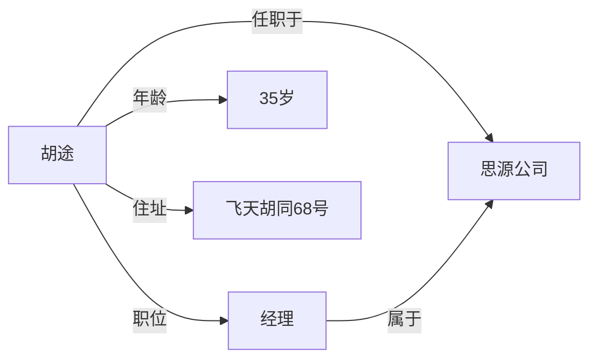
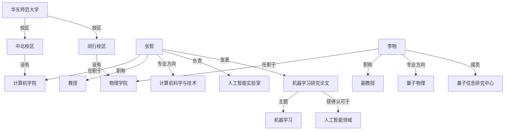
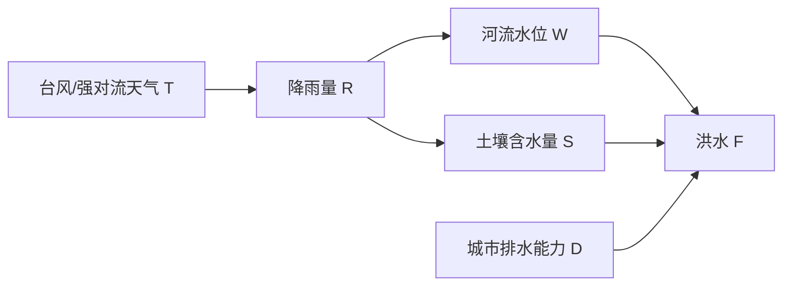

# 人工智能基础 Assignment 3

姓名：张子扬  
学号：10245102456

## 1. 用语义网络表示信息

语义网络可以把对象表示为节点，把对象之间的关系、属性和从属关系表示为有向边。下面分别给出题目中信息的语义网络表示。

### （1）胡途是思源公司的经理，他 35 岁，住在飞天胡同 68 号

也可以用三元组表示为：

| 主体 | 关系 | 客体 |
| --- | --- | --- |
| 胡途 | 任职于 | 思源公司 |
| 胡途 | 职位 | 经理 |
| 胡途 | 年龄 | 35 岁 |
| 胡途 | 住址 | 飞天胡同 68 号 |
| 经理 | 属于 | 思源公司 |

### （2）华东师范大学的语义网络表示

#### （a）华东师范大学在语义网络中的表示

该语义网络的核心结构如下：

| 主体 | 关系 | 客体 |
| --- | --- | --- |
| 华东师范大学 | 有校区 | 中北校区 |
| 华东师范大学 | 有校区 | 闵行校区 |
| 中北校区 | 设有 | 计算机学院 |
| 闵行校区 | 设有 | 物理学院 |
| 张智 | 任职于 | 计算机学院 |
| 张智 | 职称 | 教授 |
| 张智 | 专业方向 | 计算机科学与技术 |
| 张智 | 负责 | 人工智能实验室 |
| 张智 | 发表 | 机器学习研究论文 |
| 机器学习研究论文 | 主题 | 机器学习 |
| 机器学习研究论文 | 获得认可于 | 人工智能领域 |
| 李物 | 任职于 | 物理学院 |
| 李物 | 职称 | 副教授 |
| 李物 | 专业方向 | 量子物理 |
| 李物 | 成员 | 量子信息研究中心 |

#### （b）张智教授和李物副教授在语义网络中的位置及关联属性

张智教授是语义网络中的一个人物节点，位于“华东师范大学 - 中北校区 - 计算机学院”这一分支下。他与“计算机学院”之间存在“任职于”关系，与“教授”之间存在“职称”关系，与“计算机科学与技术”之间存在“专业方向”关系。同时，他还通过“负责”关系连接到“人工智能实验室”，通过“发表”关系连接到“机器学习研究论文”。该论文节点进一步连接到“机器学习”和“人工智能领域”，说明张智教授的研究成果与人工智能领域具有明确关联。

李物副教授也是语义网络中的人物节点，位于“华东师范大学 - 闵行校区 - 物理学院”这一分支下。他与“物理学院”之间存在“任职于”关系，与“副教授”之间存在“职称”关系，与“量子物理”之间存在“专业方向”关系，并通过“成员”关系连接到“量子信息研究中心”。因此，李物副教授的主要关联属性集中在物理学院、量子物理方向和量子信息研究中心。

两者的共同点是都属于华东师范大学的人员节点，都通过学院节点与学校节点相连；不同点在于张智位于中北校区计算机学院分支，研究方向偏人工智能与机器学习，而李物位于闵行校区物理学院分支，研究方向偏量子物理与量子信息。

## 2. 用概率量化不确定性

### （1）使用概率理论估计未来一年内城市发生大规模洪水的风险

可以把“未来一年内城市发生大规模洪水”看作一个随机事件，记为：

$$
F = \{\text{未来一年内发生大规模洪水}\}
$$

则城市未来一年发生大规模洪水的风险可表示为：

$$
P(F)
$$

估计该概率时，可以综合使用历史数据和当前环境数据。首先收集过去若干年城市及周边区域的洪水记录，例如每年是否发生大规模洪水、洪水等级、受灾面积、经济损失和人员转移数量等。若过去 50 年中有 5 年发生过大规模洪水，则可以得到一个初步的频率估计：

$$
P(F) \approx \frac{5}{50} = 0.1
$$

这表示在仅依据历史频率的情况下，未来一年发生大规模洪水的概率可初步估计为 10%。但实际决策不能只依靠历史频率，还需要考虑近期气候异常、城市排水能力、河道治理情况、土地硬化比例、极端降雨趋势等因素。若气象部门预测未来一年极端降雨概率上升，则应对原始估计进行修正，使风险评估更符合当前条件。

因此，概率理论的作用是把不确定的灾害事件转化为可量化的风险值，使应急管理部门能够根据概率大小决定防洪物资储备、人员疏散预案和重点区域巡查强度。

### （2）通过条件概率评估特定区域受灾可能性

如果城市不同区域对洪水的脆弱性不同，可以使用条件概率表示某一区域在洪水发生条件下受灾的可能性。设：

- $F$ 表示城市发生大规模洪水；
- $D_i$ 表示第 $i$ 个区域受灾；
- $V_i$ 表示第 $i$ 个区域具有某种脆弱性特征，例如地势低洼、排水能力差、人口密集或靠近河道。

则区域 $i$ 在洪水发生时受灾的概率可以表示为：

$$
P(D_i \mid F)
$$

如果还要考虑区域脆弱性，则可进一步写成：

$$
P(D_i \mid F, V_i)
$$

例如，A 区地势低洼且靠近河流，B 区地势较高且排水设施完善。在同样发生大规模洪水的情况下，通常有：

$$
P(D_A \mid F, V_A) > P(D_B \mid F, V_B)
$$

这说明即使城市整体洪水风险相同，不同区域的受灾概率也会因为自身条件不同而发生变化。应急管理部门可以根据条件概率对区域进行分级，例如把受灾概率较高的区域列为一级重点防控区，把受灾概率中等的区域列为二级防控区，从而实现更精细化的资源分配。

此外，若已知某区域已经出现严重积水，也可以用贝叶斯思想更新判断。例如：

$$
P(F \mid D_i) = \frac{P(D_i \mid F)P(F)}{P(D_i)}
$$

该公式表示，当观察到某区域受灾或严重积水时，可以反过来修正对城市整体洪水事件的判断。

### （3）构建概率模型为应急响应计划提供决策支持

洪水发生通常不是由单一因素决定的，而是受多个因素共同影响。可以选取以下变量构建概率模型：

- $R$：未来一段时间的降雨量；
- $W$：河流水位；
- $S$：土壤含水量；
- $D$：城市排水能力；
- $T$：台风或强对流天气影响；
- $F$：是否发生大规模洪水。

一种直观的建模方式是构建贝叶斯网络。各因素之间的关系可以表示为：

在该模型中，洪水发生概率可以表示为：

$$
P(F \mid R, W, S, D, T)
$$

其含义是：在已知降雨量、河流水位、土壤含水量、排水能力和极端天气影响的条件下，估计发生洪水的概率。

如果使用较简单的模型，也可以采用逻辑回归形式：

$$
P(F=1 \mid X) = \frac{1}{1 + e^{-(\beta_0 + \beta_1R + \beta_2W + \beta_3S - \beta_4D + \beta_5T)}}
$$

其中 $X=(R,W,S,D,T)$ 表示影响因素集合，$\beta_1,\beta_2,\beta_3,\beta_4,\beta_5$ 是各因素的权重。降雨量、河流水位、土壤含水量和极端天气通常会提高洪水概率，而排水能力越强，洪水概率通常越低，因此排水能力项可以表现为负向影响。

建立模型后，应急管理部门可以根据预测概率制定分级响应策略。例如：

| 预测洪水概率 | 风险等级 | 应急响应措施 |
| --- | --- | --- |
| $P(F) < 0.2$ | 低风险 | 常规监测，保持信息通报 |
| $0.2 \le P(F) < 0.5$ | 中风险 | 增加巡查频率，准备防汛物资 |
| $0.5 \le P(F) < 0.8$ | 高风险 | 启动应急预案，重点区域预警 |
| $P(F) \ge 0.8$ | 极高风险 | 组织人员转移，开放避险场所 |

这种概率模型可以随着新数据不断更新。例如，当实时监测发现河流水位快速上升时，模型中的 $W$ 增大，系统会重新计算 $P(F)$。如果概率超过预警阈值，就可以自动触发更高级别的应急响应。这样，概率模型不仅能描述不确定性，还能为防灾减灾中的资源调度、预警发布和人员疏散提供量化依据。
