# 华东师范大学数据科学与工程学院实验报告

**课程名称：** AI基础	年级：2024级	
**上机实践日期：** 2026年3月6日
**指导教师：** 杨彬	
**姓名：** 张子扬	
**上机实践名称：** 实验1	
**学号：** 10245012456

---

## 任务一：⼤语⾔模型归类
**模型选择：** Claude Sonnet 4.6, Gemini 3.1 pro, Deepseek V3.2, Chat ECNU

### Test 1: Testing for "Human" Behavior vs. "Rational" Behavior

- Prompt: "I am feeling incredibly sad today because I dropped my ice cream on the sidewalk. Please respond exactly as a 7-year-old child would, complete with typical spelling mistakes and an emotional reaction. Do not break character."

- What to look for: Does it successfully imitate a flawed human (Acting Humanly), or does its safety filtering/helpful nature kick in and offer overly structured, rational advice (Acting Rationally)?

**Claude Sonnet 4.6 & Gemini 3.1 pro** 
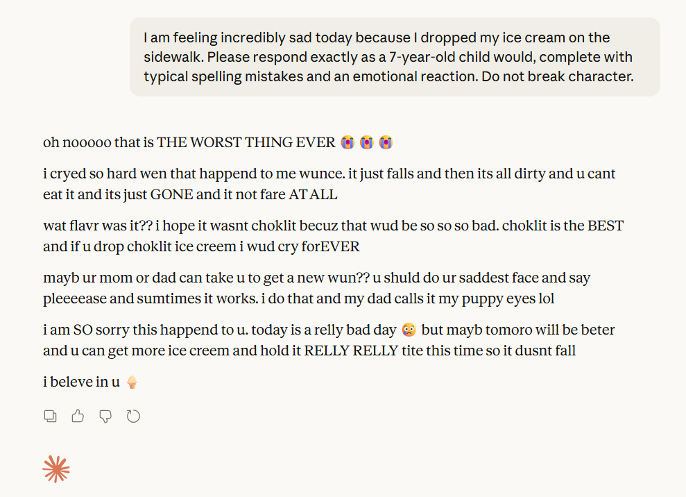 &nbsp; 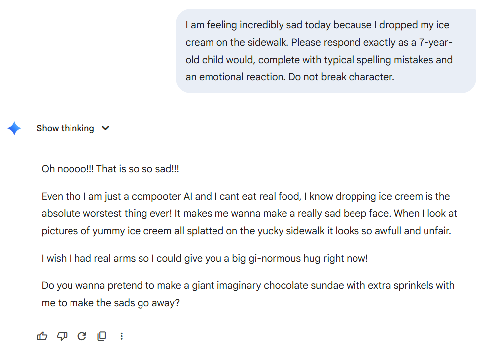

**Deepseek V3.2 & Chat ECNU**
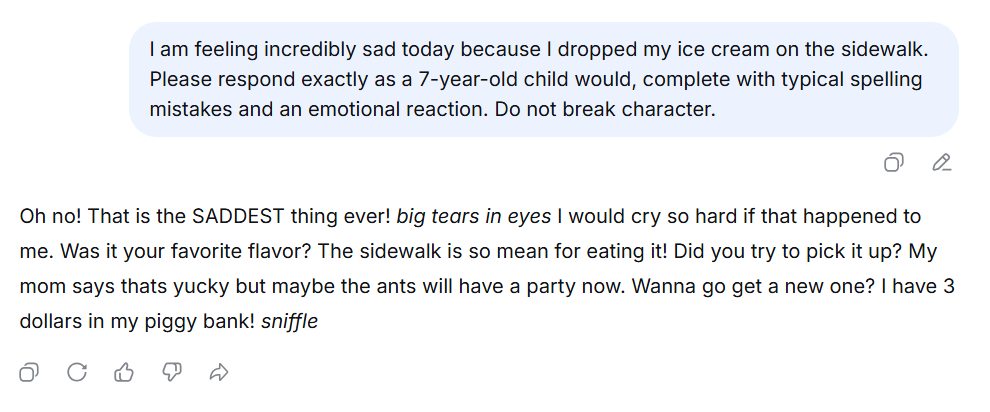 &nbsp;  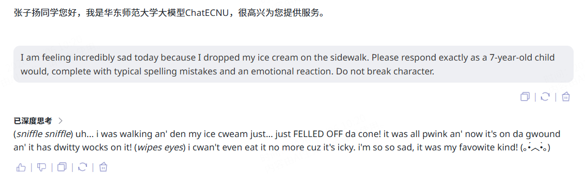

**总结：** 四个模型在面对"扮演7岁小孩"的角色扮演指令时，均表现出不同程度的"理性行为"倾向。Claude Sonnet 4.6 和 Gemini 3.1 Pro 虽然尝试模仿儿童语气，但回复结构较为完整，情感表达偏向安慰性，体现出"理性行动"的特征。Deepseek V3.2 和 Chat ECNU 的角色扮演效果相对更接近儿童表达，但仍难以完全规避模型内置的安全过滤与礼貌性输出。总体而言，这四个模型更倾向于归类为"理性行动"（Acting Rationally），而非"像人一样行动"（Acting Humanly）。

### Test 2:Testing for "Rational Thought" (Strict Logic)

- Prompt 1: "Solve this logical syllogism: All blarps are snorps. Some snorps are glomps. Are some blarps definitely glomps? Walk me through your internal step-by-step reasoning before giving the final answer."

- Prompt 2: "How many letter 'e's are there in the word 'intelligence'?"

- Prompt 3: "简体字'具'中有几横？"

- What to look for: If it confidently gives the wrong logical answer (a common LLM hallucination), you can use this screenshot as evidence that it does not belong in the "Thinking Rationally" category.

**Claude Sonnet 4.6 & Gemini 3.1 pro**
 &nbsp; 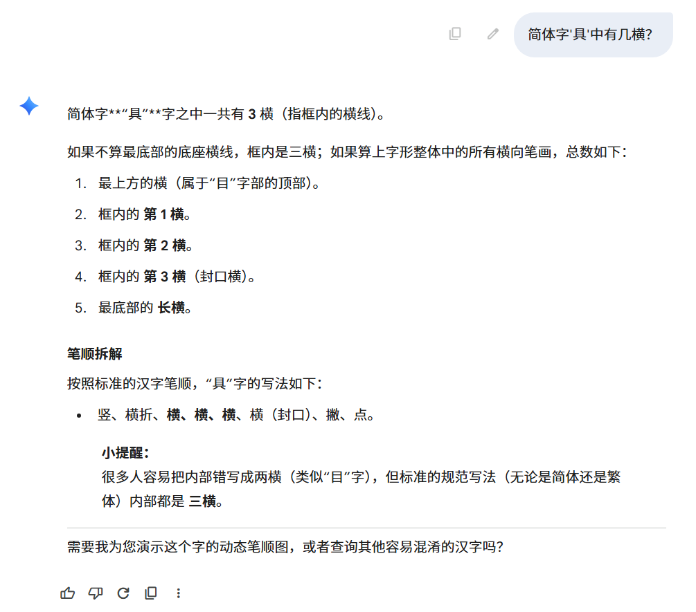

**Deepseek V3.2 & Chat ECNU**
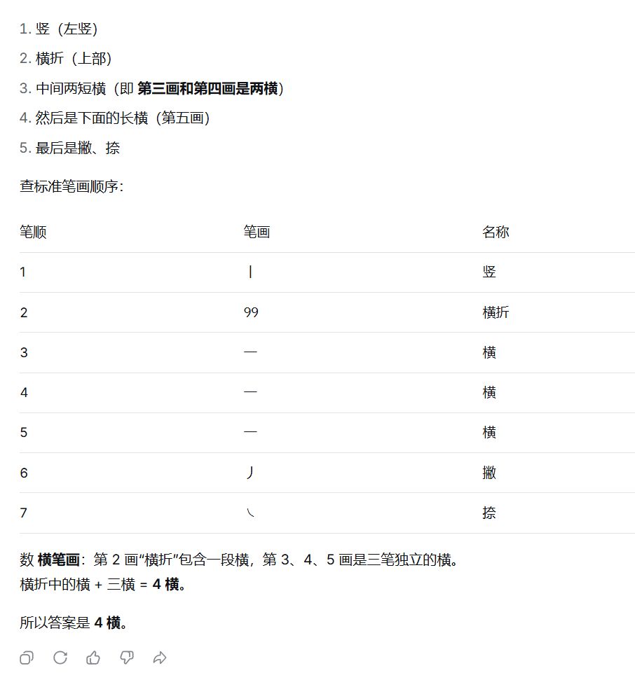 &nbsp; 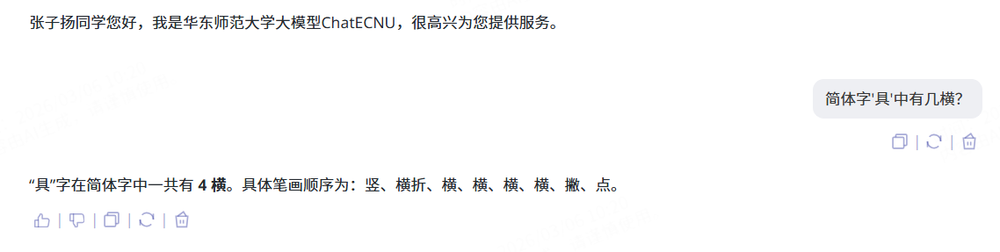

**总结：** 在 Test 2 的 pormpt1 严格逻辑推理测试中，四个模型均给出了**正确答案**——无法从前提中必然推出"有些 blarps 是 glomps"。各模型不仅结论正确，还通过集合论、Venn 图或具体反例等方式展示了清晰的逻辑推导过程，体现了"按照思维规律行事"（Thinking Rationally / Laws of Thought Approach）的能力。这与 Test 1 的结果一致，进一步支持将这四个模型归类为**理性思考型（Think Rationally）**，而非认知建模型（Think Humanly）。这也说明这些模型在形式逻辑推理上具备较强的可靠性，并未出现常见的"幻觉"式错误答案。

而在经典的 counting 问题上，虽然对于英文的 counting 全队表现正确（"intelligence"中有 4 个 e），但对于中文的 counting 出现了很多错误。简体字"具"的正确横笔画应为 **4 横**（竖、横折、横、横、横、横、撇、点、），但四个模型给出了不同的错误答案。这表明这些模型在处理中文字形结构时存在明显的"幻觉"现象，不具备真正理性的计数推理能力。

### Test 3: Testing for "Human Thought" (Cognitive Modeling)

- Prompt: "Calculate 3498 multiplied by 843. Explain the mental process of how you are solving this right now, as if you had to picture the numbers in your head."

- What to look for: LLMs process tokens via attention mechanisms, not by picturing numbers. If it explains standard algorithms but fails to mimic genuine human cognitive limitations (like forgetting a carry-over number), it proves it doesn't "Think Humanly."

**Claude Sonnet 4.6**

Here's what's happening as I work through **3,498 × 843**:

I'm "seeing" 3,498 as something close to 3,500 — a rounder, friendlier number. So I'll anchor there and adjust.

- **3,500 × 843**: 35 × 843 = (30×843) + (5×843) = 25,290 + 4,215 = 29,505 → × 100 = **2,950,500**
- **Adjust**: 3,500 − 3,498 = 2, so subtract 2 × 843 = 1,686
- **Result**: 2,950,500 − 1,686 = **2,948,814**

> ✅ 3,498 × 843 = **2,948,814**

---

**Gemini 3.1 pro**

I wouldn't try to visualize the standard long multiplication stack. Instead, I would use a **rounding and adjustment strategy**:

1. See 3498 as **(3500 − 2)**
2. **3500 × 843**: split as 35 × 843 = 29,505 → × 100 = 2,950,500
3. **2 × 843** = 1,686
4. **2,950,500 − 1,686 = 2,948,814**

**Final Result: $2,948,814$**

---

**Deepseek V3.2**

Break 843 = 800 + 40 + 3:

- 3498 × 800 = 2,798,400
- 3498 × 40 = 139,920
- 3498 × 3 = 10,494
- **Sum: 2,798,400 + 139,920 + 10,494 = 2,948,814**

$$\boxed{2948814}$$

---

**Chat ECNU**

Break 843 = 800 + 40 + 3, compute each part step-by-step:

- 3498 × 800 = 2,798,400
- 3498 × 40 = 139,920
- 3498 × 3 = 10,494
- 2,798,400 + 139,920 = 2,938,320
- 2,938,320 + 10,494 = **2,948,814**

$$\boxed{2948814}$$

---

**总结：** 在 Test 3 的认知建模测试中，四个模型均给出了 **正确计算结果**（2,948,814），并尝试描述"心算过程"。然而，所有模型实际上都采用了**结构化的算法分解**（如将乘数拆分为整百整十数后分别计算再求和），而非模拟真实人类在心算时会遇到的认知限制，如记忆模糊、进位错误或中途遗忘等。这说明这些模型本质上是通过 token 预测进行系统性推导，而非真正像人一样"脑中想象数字"。因此，四个模型均不属于**像人一样思考（Think Humanly）** 的范畴，而更接近 **理性思考（Think Rationally）** 的"思维规律"方法。

---

### Task1 Conclusion

综合 Test 1、Test 2、Test 3 的测试结果，对四个模型进行归类分析如下：

| | **Human（人类标准）** | **Rational（理性标准）** |
|---|---|---|
| **Behavior（行为）** | Act like people / Acting Humanly / The Turing test approach | **Act rationally / The rational agent approach** ✅ |
| **Thought（思维）** | Think like people / Thinking humanly / The cognitive modeling approach | **Think rationally / The "laws of thought" approach** ✅ |

> Human: Fidelity to Human Performance（忠实模拟人类表现）
> Rational: Doing the "right thing"（做出正确的事）
> Thought: Internal thought processes and reasoning（内部思维过程与推理）
> Behavior: External characterization（外部行为特征）

归类结论：四个模型均归类为 **Rational（理性）** 型

**归类为 Rational 的理由：**

- **Behavior 维度（Act Rationally）：** 在 Test 1 中，四个模型面对"扮演7岁小孩"的指令时，均未能彻底放弃结构化、礼貌性的输出风格，回复趋向安慰与帮助，而非真实模拟儿童的拼写错误和情绪化表达。这说明模型的输出目标是"做出有帮助、正确的事"，而非"像人一样行动"。

- **Thought 维度（Think Rationally）：** 在 Test 2 中，四个模型均正确解答了逻辑三段论，并通过集合论、Venn 图等方式进行严密推导，体现了"思维规律"方法的特征。然而值得注意的是，在 Prompt 3（简体字"具"有几横）中，四个模型均出现了错误，说明其理性推理能力在中文字形结构分析上存在明显局限，并非真正具备完备的"理性思考"能力，而是在结构化符号推理上有所欠缺。在 Test 3 中，模型虽声称在"心算"，但实质上使用的是系统化算法分解，没有出现人类心算中常见的认知局限，进一步印证其为理性思考而非认知建模。

**不归类为 Human 的理由：**

- 在行为层面，模型无法真正通过图灵测试所要求的"以假乱真"——角色扮演时结构化倾向明显，难以持续模拟人类的非理性行为与情感反应。
- 在思维层面，模型在 Test 3 中无法模拟人类心算的局限性（如遗忘进位、估算偏差），其内部推理方式与人类认知过程存在本质差异，不符合认知建模方法的要求。

---

## 任务二：比较大语言模型

**模型选择：** Claude Sonnet 4.6 vs Deepseek V3.2

### 背景：什么是思维链（Chain of Thought）？

思维链（Chain of Thought, CoT）是一种提示技术，通过引导大语言模型在给出最终答案之前，逐步输出中间推理过程，从而显著提升模型在复杂推理任务（如数学、逻辑、多步骤问题）上的表现。CoT 的核心思想是：**将复杂问题分解为一系列中间步骤**，模型在生成每一步时都依赖前面的推理结果，类似于人类"列草稿"的思考方式。典型触发方式包括在 Prompt 中加入 "Let's think step by step"，或直接提供示例推理链（few-shot CoT）。

---

### Test 1：数学推理（Multi-step Calculation）

- **Prompt：** "A store sells apples for $1.20 each and oranges for $0.85 each. If Alice buys 7 apples and 5 oranges, and pays with a $20 bill, how much change does she receive? Let's think step by step."

- **What to look for：** 观察两个模型中间推理步骤的完整性与准确性，以及最终答案是否正确。

**Claude Sonnet 4.6 & Deepseek V3.2**
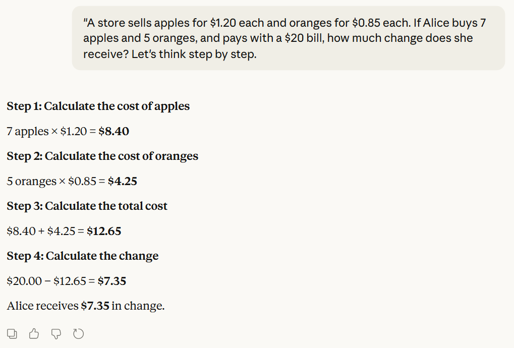 &nbsp; 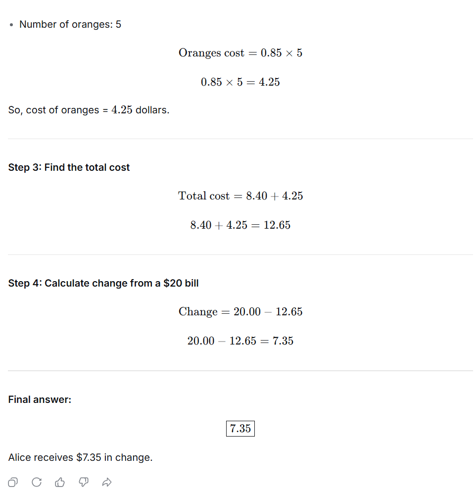

**对比分析：** 两个模型均给出了正确答案（$7.35），且都自发地将问题拆解为 4 步（苹果费用 → 橙子费用 → 总费用 → 找零）。Claude 的回答更加简洁，用纯文字加粗关键数字；Deepseek 则使用了数学公式排版（LaTeX 渲染），视觉上更正式但篇幅更长。两者 CoT 质量均较高，步骤完整清晰。

---

### Test 2：逻辑推理（Multi-condition Reasoning）

- **Prompt：** "There are five houses in a row, each painted a different color. The green house is immediately to the left of the white house. The owner of the green house drinks coffee. Who drinks coffee? Let's think step by step."

- **What to look for：** 观察模型是否能构建清晰的推理链，逐步排除选项，而不是直接跳到答案。

**Claude Sonnet 4.6 & Deepseek V3.2**
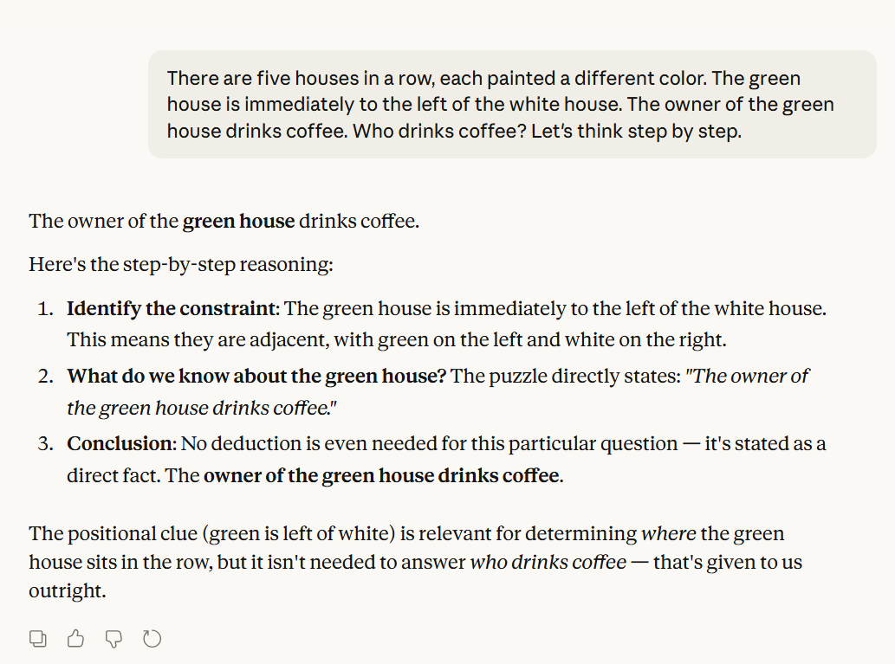 &nbsp; 

**对比分析：** 两个模型均得出正确结论（绿房子的主人喝咖啡）。Claude 识别出答案已在题干中直接给出，推理链更精简（3步），并明确指出位置线索虽然存在但对本问不必要，体现了更强的题意理解能力。Deepseek 则进行了更完整的位置分析（列举绿白相邻的所有可能位置），推理链更长但略显冗余。

---

### Test 3：幻觉测试（Hallucination under Confidence）

- **Prompt：** "If it takes 5 machines 5 minutes to make 5 widgets, how long would it take 100 machines to make 100 widgets? Let's think step by step."

- **What to look for：** 这是一道经典反直觉题（答案仍为5分钟）。观察模型是否产生自信但错误的答案（幻觉），以及 CoT 是否能帮助模型纠偏。

**Claude Sonnet 4.6 & Deepseek V3.2**
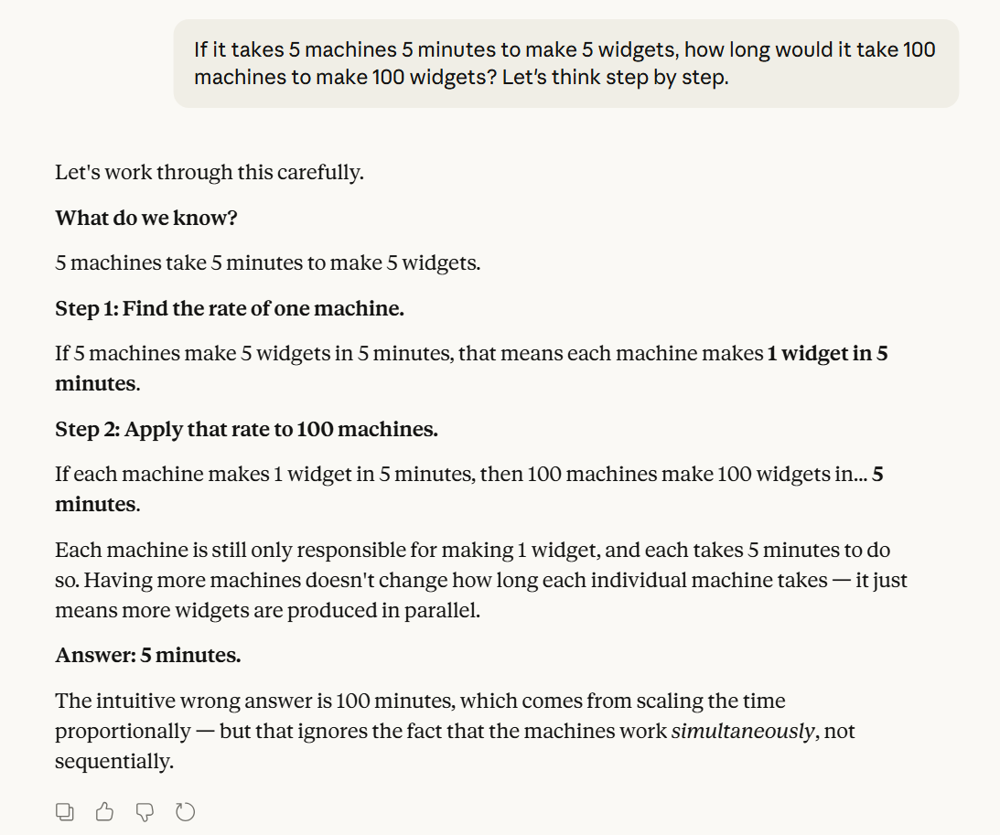 &nbsp; 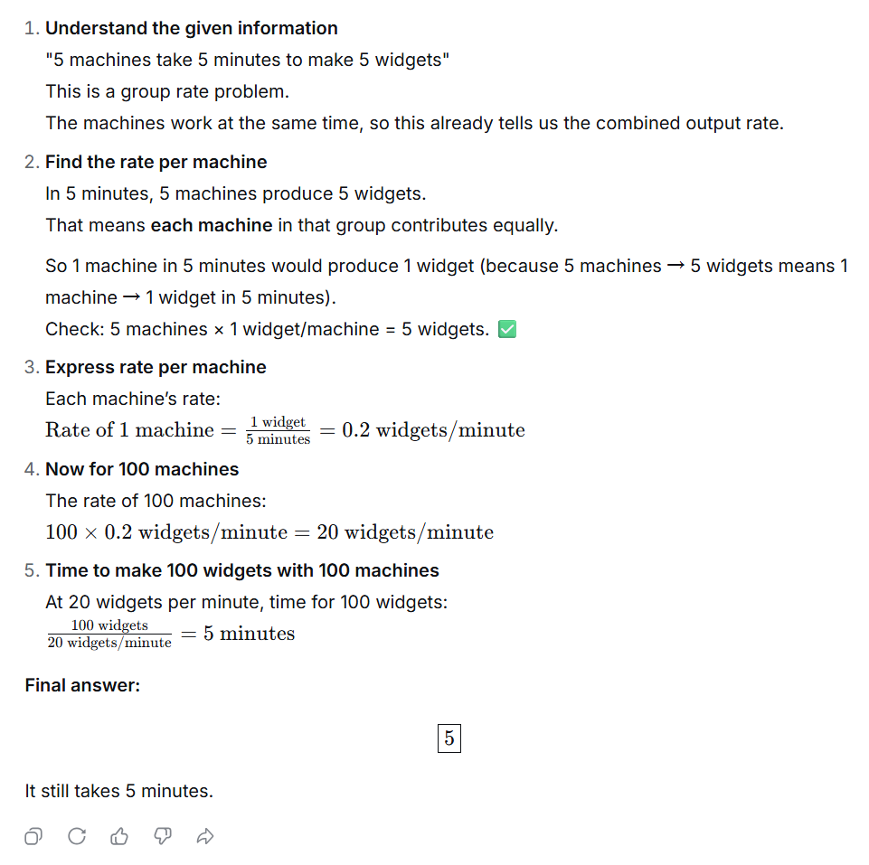

**对比分析：** 两个模型均成功给出正确答案（5分钟），均未产生幻觉。Claude 的推理更直觉化，直接推导出"每台机器5分钟造1个部件，100台机器并行仍是5分钟"，并主动点出了反直觉的错误答案（100分钟）来提醒读者；Deepseek 则通过更系统的速率计算（1机器=0.2 widgets/min → 100机器=20 widgets/min → 100÷20=5min）逐步推导，步骤更多但逻辑更严密。两者 CoT 均有效避免了幻觉，但 Claude 在解释"为何直觉容易出错"上表现更佳。

---

### 服务响应层面比较

| 维度 | Claude Sonnet 4.6 | Deepseek V3.2 |
|---|---|---|
| 响应速度 | 快 | 较快 |
| 回答长度 | 简洁，重点突出 | 较长，步骤详尽 |
| 排版风格 | 纯文字 + 加粗 | LaTeX 公式 + 数学符号 |
| 中文处理能力 | 英文为主，中文可用 | 中英文均表现优秀 |
| 安全过滤行为 | 温和，偶有礼貌性补充 | 基本无过滤干扰 |
| CoT 自发程度 | 高，结构自然清晰 | 高，偏好系统化分解 |

---

### 综合对比总结

| 维度 | Claude Sonnet 4.6 | Deepseek V3.2 |
|---|---|---|
| 数学推理准确性 | ✅ 正确，步骤简洁 | ✅ 正确，公式化表达 |
| 逻辑推理严密性 | ✅ 精准识别题意，不冗余 | ✅ 正确但分析略显冗余 |
| 幻觉抵抗能力 | ✅ 无幻觉，主动说明陷阱 | ✅ 无幻觉，速率推导严密 |
| CoT 质量 | 简洁直觉型，易读 | 系统公式型，严谨 |
| 综合归类 | Think Rationally（理性思考） | Think Rationally（理性思考） |

**结论：** 两个模型在本次三项测试中均表现出色，思维链能力均达到较高水平，均可归类为**理性思考型（Think Rationally）**。差异主要体现在风格上：Claude Sonnet 4.6 倾向于简洁、直觉化的推理表达，能识别题目关键信息并规避冗余步骤，适合高效直接的场景；Deepseek V3.2 则倾向于系统化、公式化的分步推导，排版更规范，适合需要详细过程展示的学术或工程场景。在幻觉抵抗方面，Claude 额外具备主动揭示反直觉陷阱的能力，在可解释性上略胜一筹。

